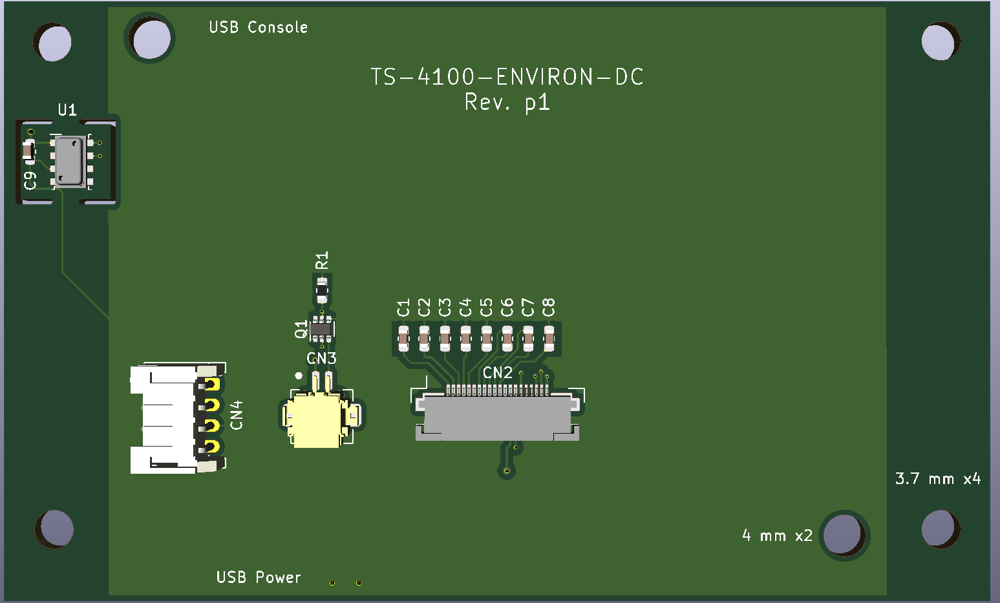

# TS-4100 Environmental Monitor Daughter Card



The project is intended to showcase using the TS-4100 daughtercard interface, using the TS-4100 ZPU (32-bit stack based microcontroller running inside of the FPGA), as well as using our [buildroot-ts.git](https://github.com/embeddedarm/buildroot-ts) repository to showcase creating a complete and deployable application using the TS-4100 as a standalone SBC.

This repository contains the complete sources for our demo daughtercard for the TS-4100. These include PCB source files (KiCad format), mechanical frame/enclosure files (2D SVG), the main software that is run, and a complete Buildroot package.

See the [Buildroot](#Buildroot) section below for how to build the software image.

See the sections below for detailed technical information and full assembly.

# Application Information
This application exercises multiple TS-4100 interfaces by:
* Querying local weather forecasts via [wttr.in](https://wttr.in)
* Gathering interior environmental information via an on-board temperature/pressure/relative humidity sensor
* Compile, format, and display the above on an attached 128x64 px monochrome LCD
* Enable the LCD backlight when there is nearby motion from a PIR sensor using the ZPU to offload this activity from the CPU
* Receive power from a Micro USB cable

## Use
Note! The clear acrylic sheets show fingerprints VERY well! Be sure to only handle by the side or while wearing gloves to prevent buildup of smudges!

The whole device is powered via the USB connector on the TS-4100. The daughtercard lists on the back which USB connector is power and which can be used as a console.

### Power
To power the unit, run a USB micro cable through the side or rear of the frame, using the hole in the rear of the frame to guide the plug in to place. The green LED on the PIR sensor will rapidly flash, and after a few seconds the display will begin showing activity as the application starts.

### Console
The USB micro connector on the top of the unit is used for serial console. It can be plugged in at any time with respect to power. The serial console settings are `115200 baud, 8 data bits, no parity, 1 stop bits, no flow control` aka `115200 8n1`. Readily available terminal clients are [PuTTY](https://www.putty.org/) (Windows, free), [SerialTools](https://apps.apple.com/us/app/serialtools/id611021963) (OS X, free), [Serial](https://decisivetactics.com/products/serial/) (OS X, non-free), or command-line tools such as `screen`, `picocom`, etc across OS X and Linux. Once connected to the TS-4100, it will appear as a USB serial device that can be opened with any of the aforementioned clients.

To log in, the user account is `root` and there is no password set. If opening the console after the unit has been powered up, you may need to press `enter` to get the login prompt to appear on screen.

#### Changing WiFi network
If the WiFi SSID or password need to be changed, it is best to do so by logging in to the console, and issuing the following commands:

```
mount -oremount,rw /
wpa_passphrase "your network SSID" > /etc/wpa_supplicant.conf
# Then type network passphrase on the empty line after entering the above command
# Verify the correct settings with the following command which should show the SSID and PSK
cat /etc/wpa_supplicant.conf
mount -oremount,ro /
reboot
```


## TS-4100
The TS-4100 differs from our other SoM products in that it offers a 16-pin 0.1" spaced [pin header](https://docs.embeddedarm.com/TS-4100#HD1_Expansion_Header) as well as 2 Micro USB connectors on the PCB directly. Power input and serial console are available via USB, with the 16-pin header providing GPIO, an SPI interface, and an I2C interface. These, combined with the on-board WiFi and Bluetooth module, allow for integration of the TS-4100 in smaller form-factor applications.

## Daughtercard Interface
The TS-4100-ENVIRON-DC daughtercard uses: the I2C bus for connecting to an MS8607 temperature/pressure/relative humidity sensor, the SPI bus for connecting to the LCD, and 2 of the GPIO are used for input from an off-the-shelf passive infrared (PIR) motion sensor and enabling the LCD backlight.

### SPI LCD
The SPI LCD is a 128x64 px monochrome LCD panel with backlight. It uses an SPI interface that is based on the ST7565P standard. The LCD is powered via 3.3 VDC output from the daughtercard interface. The LCD backlight is also powered from 3.3 VDC from the daughtercard interface, it is connected to the anode of the backlight with the cathode run through a pair of MOSFET switches to allow GPIO control of the backlight via the PIR sensor.

### I2C Sensor
The I2C interface connects to a single MS8607 temperature/pressure/relative humidity sensor. This chip is actually two separate dies in a single package that appear at two separate I2C addresses. The I2C sensor is powered via 3.3 VDC output from the daughtercard interface.

### PIR Motion Sensor
An OpenPIR sensor is used to detect nearby motion. The output signal from the PIR sensor is connected to one GPIO pin with the backlight enable connected to a second GPIO pin. A simple ZPU application is used to turn on the backlight when the PIR sensor detects motion. See the [ZPU](#ZPU) section below for details of the operation. The OpenPIR board is powered via 3.3 VDC output from the daughtercard interface.

## Software
The main application logic is handled by a single shell script. This script pulls local weather data from [wttr.in](https://wttr.in), and reads the local environment information via the I2C temperature/pressure/relative humidity sensor on the daughtercard. The shell script is named `env-collect.sh`.

The output of the collected data is formatted to fit on the screen (25x10 characters with the 4x5 pixel font used), and then the full text buffer is piped to the drawing tool `cairo-display-text`. This tool uses [Pango](https://pango.gnome.org/), [Cairo](https://www.cairographics.org/), and [Fontconfig](https://www.freedesktop.org/wiki/Software/fontconfig/) to take the text buffer and render it for the LCD screen.

A customized pixel font was created to cleanly handle all of the UTF-8 glyphs that are used by the [wttr.in](https://wttr.in) service.

Buildroot is used to compile all of the utilities and provide a bootable environment. In order to accomplish this, there are a couple of clever applications of Buildroot and this repository.

First, this repository is a GNU/Linux source project using Autotools to configure the compilation of `lcd-helper` and `cairo-display-text` applications. The project is set up to also install the `env-collect.sh` script and ZPU firmware binary directly to the binary directory of the build process, as well as install the font file to the system fonts directory.

Second, this repository contains a Buildroot external tree. This is what provides the Buildroot configuration file, project specific Buildroot board files, as well as defines the package to build this repository's userspace software. The Buildroot configuration in this repository defines this repository as the package `ts4100-environ`. The package handles the compilation and installation of the binaries noted above.

Last, the Buildroot external configuration contains, as a submodule, our [buildroot-ts.git](https://github.com/embeddedarm/buildroot-ts) repository. The buildroot-ts.git repository is also set up as a Buildroot external tree. It provides our utilities packages in addition to base configuration files for Buildroot. Inside of that is upstream Buildroot included as a submodule. These two external trees nest together to isolate their specific implementations from each other and from Buildroot itself. The external tree feature of Buildroot is useful in making project specific repositories such as this.

### SPI LCD
A virtual framebuffer device is created to represent the LCD and then a small daemon by the name of `lcd-helper` is started. This daemon is responsible for reading and writing between the virtual framebuffer and the actual LCD device. Applications write to the LCD by writing to the virtual framebuffer device. The actual application text is rendered to the virtual framebuffer via the `cairo-display-text` application. Any text that is given to `cairo-display-text` via stdin is then rendered to the framebuffer with a border around it. This is then displayed on the LCD screen by the `lcd-helper` daemon.

### I2C Sensor
The I2C temperature/pressure/relative humidity sensor is controlled by kernel drivers. The Buildroot external tree in this repository adds an FDT and a kernel configuration fragment. This adds the necessary drivers to our default kernel config while the FDT tells the kernel how the LCD and I2C sensors are connected. The main script simply reads the I2C sensor values from the kernel and normalizes their output to degrees Fahrenheit, inches mercury, and relative humidity.

### ZPU
The OpenPIR sensor used has a relatively short pulse duration when it is activated. It can be increased at the expense of longer startup times. A 7 second output pulse duration requires a startup time of roughly 4 minutes. In order to easily catch the PIR pulse output, have a fast startup time, and be able to use the short pulse to enable the backlight for an arbitrary duration of time, the [ZPU inside of the TS-4100 FPGA](https://docs.embeddedarm.com/TS-4100#ZPU) was used. The ZPU application here is very straightforward, the backlight will turn on if there is motion, and remain on until there is 10 seconds without motion.

# Building
## Buildroot
Buildroot will output a compressed tarball archive that is bootable on the TS-4100 eMMC or microSD card. The instructions below assume an SD card is used.

Optionally, Docker can be used to build this project, see [Using Docker](#Using-Docker) below.

* Clone the repository and its submodules
```
git clone --recurse-submodules https://github.com/embeddedarm/ts4100-environ-dc
```

* Update wpa_supplicant.conf with the WiFi network that the TS-4100 will connect to
```
wpa_passphrase "your network SSID" "your network passphrase" > technologic/board/ts4100-environ/wpa_supplicant.conf
```
Note that passphrase on the command line is optional, if not provided, it will be prompted for.

* Build the output image (this will take some time)
```
cd ts4100-environ-dc/buildroot/
make ts4100_environ_defconfig clean all
```

* Write the tarball to a [microSD card](https://docs.embeddedarm.com/TS-4100#microSD_Card). Note that the Buildroot output file is `ts4100-environ-dc/buildroot/buildroot-ts/buildroot/output/images/rootfs.tar.xz` Replace the tarball used in the instructions above with the Buildroot output.

* Insert the SD card in the TS-4100, connect a USB cable to the P2 Micro USB connector and [open a terminal](https://docs.embeddedarm.com/TS-4100#Get_a_Console). Connect a second Micro USB cable to the P1 connector to power on the device. In the terminal, use `ctrl+c` to enter the U-Boot shell. Once in the U-Boot shell, run the following commands
```
env set force_jpsdboot 1
env set usbboot 0
env save
```
This will force the unit to boot from MicroSD and skip detection of USB devices in U-Boot

* The TS-4100 is now set up to boot directly to the MicroSD card that has been formatted with the full application.

## PCB
### Ordering
The `kicad_pcb/` directory contains the PCB source files. We used a PCB fabricator that could directly accept KiCad board files without having to create Gerber files for them. This was to simplify the ordering process as much as possible. We recommend using a similar PCB fabricator.

Inside of this directory, a bill-of-matierals is available with recommended distributors. The only component that is not readily available from a distributor is the LCD screen itself. All other components are available from a number of US distributors.

### Assembly
While nearly all of the components are SMD, they are large enough to be able to be hand soldered by individuals with a moderate skill in SMD PCB soldering. The PCB itself has not been designed for automated assembly and is simply a demo.

## Mounting Frame
### Ordering
The `mechanical/` directory contains the original 2D drawing SVF file that can be used for laser cutting purposes. The frame is best cut from a ~2.84 mm sheet of clear acrylic. Different thicknesses will change the mounting and assembly.

The frame was ordered via a laser cutting facility that prefers SVG files with specific line and fill colors. The SVG file is set up specifically for this.

## Final Assembly
### TS-4100 and TS-4100-ENVIRON-DC
The daughtercard needs to have all components soldered in place.

Before attaching the TS-4100 to the TS-4100-ENVIRON-DC, be sure to install the SD card if using an SD card! It is possible to remove the microSD card with the two affixed to each other, but is very difficult.

The TS-4100 is plugged in to the TS-4100-ENVIRION-DC card, and held in place with 2x M3-0.5x16 screws, each using 4x of the laser cut acrylic spacers.

### PIR Sensor
The PIR sensor used in this project was set up with:
* A JST PH connector soldered to the back side of the PCB. Installing this on the top side will result in reverse current to the OpenPIR sensor.
* The OSC trimpot was rotated fully CCW (this controls the output pulse duration and startup time).
* The SEN trimpot is adjusted after fully installed to acheieve the best sensitivity for the installation. This can be adjusted through the hole in the rear of the frame.
* The switch on the rear is set to "SNGL" to allow triggering on someone approaching OR retreating from the unit.


### Front Frame
Remove the protective sheets of the front frame at this time. It may be wise to wear gloves as to prevent fingerprints.

The PIR sensor is installed in to the back side of the front frame. The PIR sensor should be installed so the JST connector is on the left side when facing the frame, i.e. on the same side as the Technologic Systems' Arrows logo. It is affixed with 4x M3-0.5x12 screws, each using 2x of the laser cut acrylic spacers. Take care not to let the nuts short against adjcent components on the PCB.

The LCD, TS-4100, and TS-4100-ENVIRON-DC are all stacked together. Run 4x M3-0.5x35 bolts from the front side of the frame and place face down on a desk. Slide the LCD face down through the 4x bolts. Set 6x of the laser cut acrylic spacers on each of the four bolts. Slide the TS-4100 and TS-4100-ENVIRON-DC stack on to the four mounting bolts, positioning the stack so the TS-4100 is closer to the LCD and the LCD Flat-Flex-Connector is on the bottom to allow connection to the LCD.

Loosely add one nut to each of the 4x bolts to temporarily affix everything in place.

Connect the LCD flex cable to the FFC on the daughtercard. Connect the LCD backlight cable to the daughtercard. And connect a JST cable between the PIR sensor and the daughter card. Position the cable to run up across the TS-4100-ENVIRON-DC, down to the PIR sensor, creating a gentle curve along the way to prevent cable damage but keep it in the frame's envelope.

Insert 2x M3-0.5x35 bolts through the bottom holes of the frame, and set the frame back on its face. Add 9x laser cut acrylic spacers to these two bolts. Remove the 4 nuts holding the TS-4100 and TS-4100-ENVIRON-DC stack in place. Add 2x more laser cut acrylic spacers to each of the 4 bolts sticking through the daughtercard. Proceed to the rear frame instructions.

### Rear Frame
Remove the protective sheets from the rear frame front and back.

If not using wall mounting, skip this paragraph. The reverse side of the rear frame has a small outline etched in it at the top to denote the location of the mounting hole. First, remove the protective film from both sides of the small laser cut square outline, and glue it to the outlined area on the frame. Once this dries, remove the protective film from the laser cut square with the keyhole mounting shape cut out and glue it to the square outline. Optionally, the remaining cutout from the keyhole and the square outline can be stacked and glued near the bottom side of the frame to keep the top and bottom of the frame the same distance from the wall when mounted.

Place the rear frame on the stack. It should be aligned so that the cut-out provides access to the "USB Power" Micro USB connector on the TS-4100. Ensure the frame is level, add spacers as needed. Add bolts to affix the whole frame in place. Do not overtighten, use a small amount of thread locker on the nuts  if desired.

# Application Tips
* To keep the backlight on all the time, disconnect the PIR sensor. The pullup on the input pin will naturally keep the backlight in the "on" state.
* The frame can be cleaned with warm washcloth with some soap and wiped clean. Avoid using harsh substances such as Acetone to clean the surface.
* Handle the frame by the edges to prevent buildup of fingerprints on the frame. Fingerprints and other grime show up very easily on the clear frame sheets.
* The frame can be sat on a flat surface, or hung. See [Rear Frame](#Rear-Frame) for information on how to make hanging possible.
* The rear cutout is for ease of plugging in a USB cable for power. The cable can either be dangled straight down when hanging, or curved between the frame panels and out the side when set on a surface. It is not recommended to run the cable through the cutout as this can put too much force on the cable and therefore the connector.

# Using Docker
Optionally, Buildroot can be built in a Docker container. The container is maintained in lock-step with this project and the upstream Buildroot submodule. Meaning it is possible to go back to a specific commit in history and get a valid environment for building in via Docker.

The container is implemented as a simple front-end script, any arguments passed to the script will be passed directly to the `buildroot/` directory inside of the container. The first time the script is run, it will build the container so this may take additional time.

Building the Buildroot otuput image via Docker would use the following command
```
./scripts/run_docker_buildroot.sh make ts4100_environ_defconfig clean all
```

## Notes on using Docker

* Choose building either from the host workstation or Docker container, it is not recommended to mix and match. Do a `make clean` from one build system in order to be able to cleanly switch to another. Switching between the two without `make clean` in between will likely cause build issues
* The `pwd` is mapped to `/work/` inside the container, with `$HOME` being set to `/work/`. Any changes made inside of `/work/` will be retained, any changes to the rest of the container filesystem will be lost once the container is exited
* The ts4100_environ config has ccache enabled though Buildroot. Normally, this lies at `~/.buildroot-ccache`. Inside the container however, the `buildroot/` directory is set to `$HOME`. If relying on ccache in Buildroot, be sure to continually use the same build system to prevent excessive work
* It's possible to enter the shell of the container by passing `bash` to the script, i.e. `./scripts/run_docker_buildroot.sh bash`
